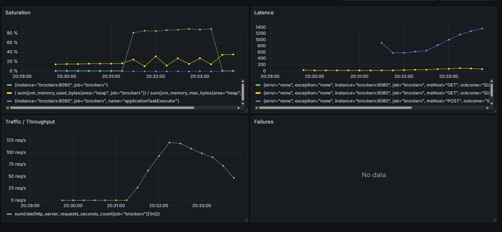

# Rapport test de charge

Dans ce rapport nous avons les graphes generer par grafana et relie au
donnes envoyer par prometheus

Pour commencer nous avons la premiere partie de test sur les ajouts d'ordres
qui sont ack donc envoit d'ordres -> ack pour l'application monolithique Rest

Pour regarder les donnees en temps relles il suffit d'aller sur le lien :
[Lien Grafana sur la VM](http://10.194.32.168:3000/d/cf180a27-bb43-482d-a372-745c680c98c8/4-golden-metrics?orgId=1&from=now-5m&to=now&timezone=browser&refresh=5s)

Dashboard Grafana Api Rest monolithique

- On as environ 100 req/s
- latence de 800ms
- No failure

