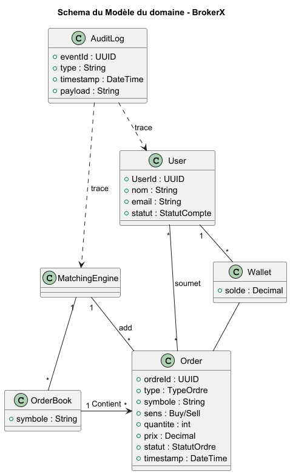
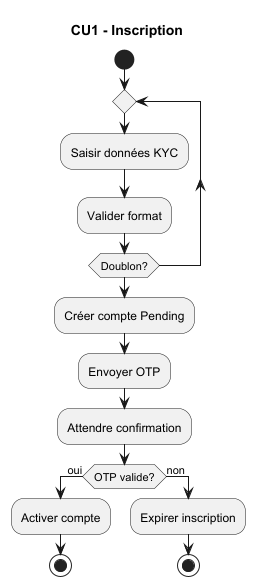
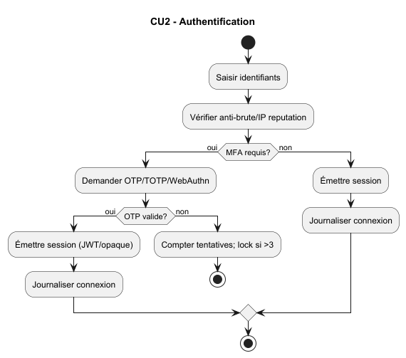
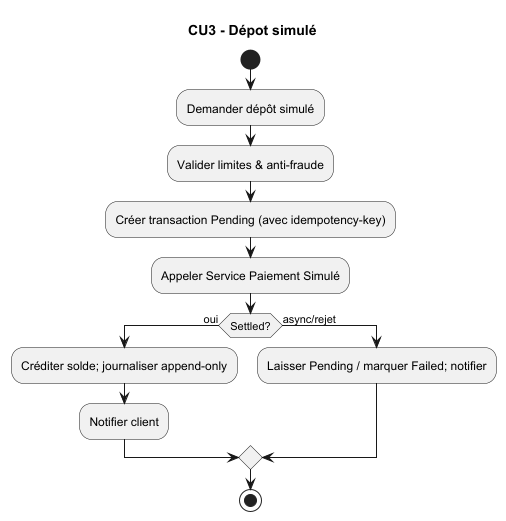
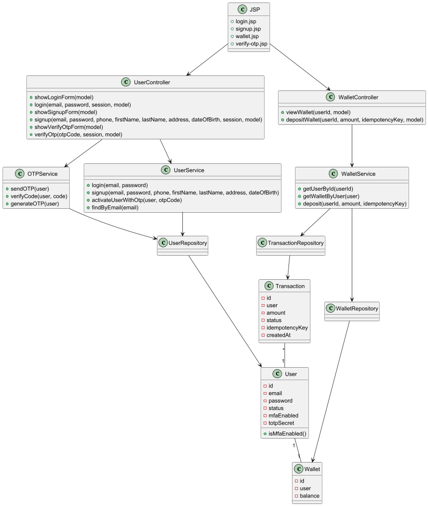
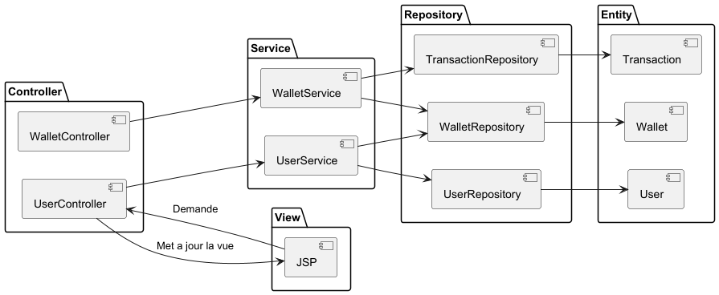
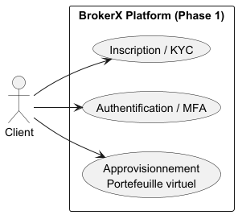
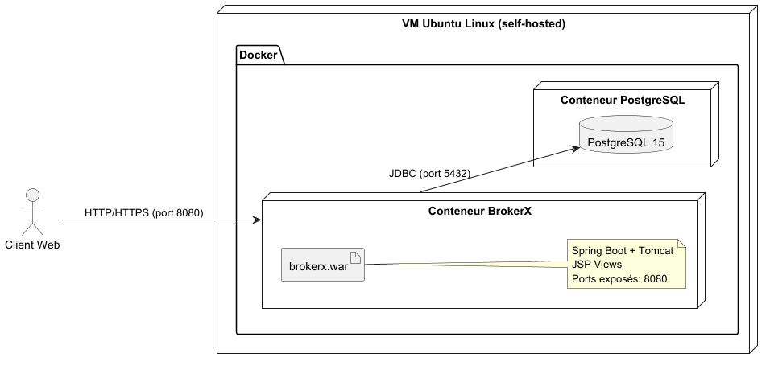

# BrokerX+ - Documentation d'Architecture

Ce document, basé sur le modèle arc42, décrit une application de courtage pour
la compagnie BrockerX dans le cadre du
LOG430.

## 1. Introduction et Objectifs

### Panorama des exigences

L'application « BrokerX » est une plateforme de courtage en ligne permettant
aux investisseurs de:

- Créer et gérer un compte utilisateur
- Authentifier et sécuriser l'accès
- Placer, consulter et annuler des ordres d'achat/vente
- Consulter un portefeuille et l'historique des transactions

L'objectif de la phase 1 est de concevoir et livrer une architecture
monolithique évolutive, tout en préparant une
transition future vers une architecture Micro-service et pour finalement ce
penché vers une approche orientée événements

### Objectifs qualité

| Priorité | Objectif qualité          | Scénario concret                                                                                                            |
|----------|---------------------------|-----------------------------------------------------------------------------------------------------------------------------|
| 1        | **Performance**           | Latence P95 ≤ 500 ms (monolithe), ≤ 250 ms (microservices), ≤ 100 ms (event-driven). Débit ≥ 1200 ordres/s en phase finale. |
| 2        | **Disponibilité**         | 90 % (mono) → 95,5 % (MS) → 99,9 % (event-driven). Service accessible même en cas de panne d’un composant.                  |
| 3        | **Observabilité**         | Logs structurés + métriques (4 Golden Signals) dès phase 2, traces distribuées à partir de la phase 3.                      |
| 4        | **Sécurité / Conformité** | MFA obligatoire pour login, contrôles KYC/AML, idempotence pour ordres, audit trail immuable.                               |
| 5        | **Maintenabilité**        | Architecture modulaire permettant le passage progressif mono → microservices → event-driven sans réécriture complète.       |

### Parties prenantes (Stakeholders)

- **SoftWare engineer** : Apprendre les outils de développement modernes et les
  pipelines CI/CD
- **Clients** : utilisateurs via interface web
- **Opérations Back-Office**: gestion des règlements, supervision
- **Conformité/Risque** : surveillance pré- et post-trade.
- **Fournisseurs de données de marché**: cotations en temps réel.
- **Bourse externes**: simulateurs de marché pour routage d'ordres

## 2. Contraintes d'architecture

### Contraintes d’architecture

| Contrainte                 | Description                                                                                               |
|----------------------------|-----------------------------------------------------------------------------------------------------------|
| **Environnement cible**    | L’application doit être déployée sur une machine virtuelle fournie par l’école/labo.                      |
| **Conteneurisation**       | Tous les services doivent être packagés dans des conteneurs Docker pour assurer portabilité et isolation. |
| **CI/CD automatisé**       | Le déploiement doit être automatisé via un pipeline Github CI/CD (build, tests, déploiement).             |
| **Tests automatisés**      | Des tests unitaires et d’intégration doivent être exécutés automatiquement dans le pipeline.              |
| **Observabilité minimale** | Journaux applicatifs et monitoring basique doivent être activés dès la première version.                  |

## 3. Portée et contexte du système DDD

Le projet suit les principes du Domain-Driven Design pour structurer le code
autour des concepts métier.

Sketch du modele du domaine

# Modèle DDD - BrokerX

## Entités (Entities)

- **User**  
  Identifiée par `userId`.  
  Attributs : nom, email, statut.  
  Associée à un **Wallet**.

- **Wallet**  
  Identifiée par `walletId`.  
  Contient un solde et les **Positions** détenues par l’utilisateur.

- **Transaction**  
  Identifiée par `transactionId`.  
  Référence un User, un montant, un statut et une clé d’idempotence.  
  Sert pour les dépôts/retraits.

- **Order**  
  Identifiée par `orderId`.  
  Représente un ordre d’achat/vente (type, symbole, quantité, prix, statut,
  timestamp).

- **Execution**  
  Identifiée par `executionId`.  
  Représente une exécution totale ou partielle d’un ordre.

- **OrderBook**  
  Carnet d’ordres pour un instrument (côté achat/vente, trié par priorité
  prix/temps).

## Services de domaine

- **UserService**  
  Gère les opérations utilisateurs (inscription, login, activation via OTP).

- **WalletService**  
  Gère le portefeuille (consultation du solde, dépôt, retrait, mise à jour des
  positions).

- **TransactionService**  
  Gère le cycle de vie des transactions (dépôt, retrait, validation).

- **MatchingEngineService** (*Moteur d’appariement interne*)  
  Reçoit les ordres, les insère dans l’`OrderBook`, cherche des contreparties et
  génère des `Executions`.

- **MarketDataService**  
  Diffuse les mises à jour du carnet (`top-of-book`, exécutions, prix temps
  réel).

- **OTPService**  
  Gère la génération et la vérification des OTP pour l’authentification
  multi-facteurs.

## Repositories

- **UserRepository** : accès aux entités `User`.
- **WalletRepository** : accès aux entités `Wallet` (et `Positions`).
- **TransactionRepository** : accès aux entités `Transaction`.
- **OrderRepository** : accès aux entités `Order`.
- **ExecutionRepository** : accès aux entités `Execution`.
- **OrderBookRepository** : accès aux carnets d’ordres par symbole.

### Ubiquitous Language

Le langage métier utilisé dans le projet est défini en collaboration avec les
experts métier et est partagé par l’ensemble de l’équipe de développement. Il
sert à réduire les ambiguïtés et à uniformiser la communication entre métier et
technique.

| Terme           | Description                                                                                                                                   |
|-----------------|-----------------------------------------------------------------------------------------------------------------------------------------------|
| **User**        | Représente un client inscrit sur la plateforme, pouvant posséder un portefeuille et effectuer des transactions.                               |
| **Wallet**      | Portefeuille associé à un utilisateur, contenant le solde disponible et l’historique des transactions.                                        |
| **Transaction** | Opération financière réalisée par un utilisateur sur son portefeuille. Peut être en attente (Pending), validée (Settled) ou échouée (Failed). |
| **OTP**         | One-Time Password, utilisé pour la vérification MFA lors de la connexion.                                                                     |
| **Deposit**     | Actions permettant d’ajouter des fonds dans le portefeuille.                                                                                  |

# Priorisation des Cas d’Utilisation (MoSCoW)

| Priorité                   | Cas d’Utilisation (CU)                         | Description                                                               |
|----------------------------|------------------------------------------------|---------------------------------------------------------------------------|
| **Must have**              | CU01 – Inscription & Vérification d'identité   | Connexion sécurisée avec MFA                                              |
|                            | CU02 – Authentification                        | Garantir un accès sérurisé                                                |
|                            | CU03 – Portefeuille (dépot virtuel)            | Créditer le portefeuille virtuel                                          |
|                            | CU05 – Placement d'un ordre                    | Soumettre des ordres d’achat ou de vente                                  |
|                            | CU07 – Appariement interne & Exécution         | Exécution automatique des ordres                                          |
| **Should have**            | CU04 – Abonnement aux données de marché        | Accès en temps réel au cotations et carnets d'ordres                      |
|                            | CU05 – Historique transactions                 | Liste détaillée des ordres exécutés                                       |
| **Could have**             | CU06 – Modification / Annulation d'un ordre    | Flexibilité tant que l'ordre n'est pas totalement exécuté                 |
|                            | CU08 – Confirmation d'exécution & Notification | Renvoit et notifie le clien de la réussite ou l'echec de ses transactions |
| **Won’t have (this time)** | CU09 – Trading social                          | Copier les ordres d’autres utilisateurs                                   |
|                            | CU10 – Intégration crypto                      | Achat/vente de crypto-monnaies                                            |

### Contexte métier

Le système permet aux utilisateurs de :

- Inscription/login utilisateur (MFA optionnelle), simulation de financement.
- Consultation portefeuille et solde.
- Abonnement aux données de marché (liste de titres).
- Placement, modification et annulation d’ordres ; carnet d’ordres par symbole.
- Routage vers moteur interne (phase 1), puis vers bourse externe simulée
  (phase 2+).
- Mise à jour des positions suite aux exécutions ; confirmations et
  notifications.
- Rapports quotidiens (EOD snapshot), traçabilité complète (audit trail).

### Contexte technique

| Composant                   | Technologie / Détail                                                               |
|-----------------------------|------------------------------------------------------------------------------------|
| **Application**             | Spring Boot (Java 17+) avec JSP pour le front web                                  |
| **Base de données**         | PostgreSQL 15, accès via JPA/Hibernate                                             |
| **Sécurité**                | Authentification email/mot de passe, OTP pour vérification, MFA TOTP optionnel     |
| **Conteneurisation**        | Docker + Docker Compose sur VM Ubuntu Linux self-hosted                            |
| **CI/CD**                   | GitHub Actions pour build, tests et déploiement                                    |
| **Gestion des dépendances** | Maven (pom.xml) pour librairies Java (Spring Security, Google Authenticator, etc.) |
| **Monitoring / Logs**       | Spring Boot Actuator (health, métriques)                                           |
| **Front-end**               | JSP + JSTL avec layout global pour header/footer                                   |
| **Sessions / État**         | Session HTTP pour gérer l’utilisateur connecté et MFA                              |
| **Environnement**           | VM Ubuntu Linux, ports exposés 8080 (app) et 5432 (DB)                             |

## 4. Stratégie de solution

| Problème                          | Approche de solution                                                        |
|-----------------------------------|-----------------------------------------------------------------------------|
| **Fiabilité et qualité du code**  | Tests unitaires et d’intégration automatisés (JUnit, H2) exécutés via CI/CD |
| **Environnements reproductibles** | Conteneurisation avec Docker et orchestration via Docker Compose            |
| **Déploiement automatisé**        | Pipeline CI/CD (GitHub Actions + Maven + Docker)                            |
| **Surveillance en production**    | Exposition d’indicateurs avec Spring Boot Actuator                          |
|

## 5. Vue des blocs de construction

## 6. Vue d'exécution

## 7. Vue de déploiement

## 8. Concepts transversaux

| Domaine                 | Concept transversal appliqué                                                                              |
|-------------------------|-----------------------------------------------------------------------------------------------------------|
| **Sécurité**            | Authentification par identifiant/mot de passe + OTP (2FA). Secrets stockés via variables d’environnement. |
| **Persistance**         | Utilisation de Spring Data JPA avec PostgreSQL. Transactions ACID pour garantir l’intégrité.              |
| **Communication**       | API REST (JSON) pour l’échange entre front et back. Respect des standards HTTP.                           |
| **Gestion des erreurs** | Logs centralisés avec SLF4J/Logback. Messages d’erreurs clairs pour l’utilisateur.                        |
| **Tests et qualité**    | Tests unitaires (JUnit5), tests d’intégration (Spring Boot + H2), tests E2E via Docker Compose.           |
| **Surveillance**        | Actuator pour healthchecks et métriques. Monitoring via CI/CD.                                            |
| **Déploiement**         | Conteneurisation avec Docker. Orchestration des environnements (prod, test) via Docker Compose.           |

## 9. Décisions d'architecture

#### ADR 001 – Choix de l'architecture globale

#### Statut

Acceptée

#### Contexte

Contexte

BrokerX+ doit permettre à des clients de passer des ordres, consulter leurs
portefeuilles et recevoir des notifications
d’exécution. Pour la phase 1, l’objectif est de démontrer la faisabilité avec un
prototype de petite envergure (Proof of Concept).

La majeure partie de la logique métier (règles pré-trade, validation des ordres,
gestion de portefeuille) se trouve dans le backend. Pour éviter de complexifier
inutilement le projet, nous choisissons de nous concentrer sur le backend, tout
en servant un front minimal via JSP/Thymeleaf intégré.

Cette approche permet de :

- Se concentrer sur la logique métier essentielle

- Avoir un développement et un déploiement rapides

- Préparer une structure évolutive pour les phases futures (microservices /
  event-driven)

#### Décision

Nous choisissons une architecture monolithique modulaire, organisée en couches
logiques :

- Controllers / Adapters Web : points d’entrée REST et JSP/Thymeleaf

- Domain / Services Applicatifs : logique métier et règles pré-trade

- Repository / Adapters Persistance : accès aux données via ORM (Spring Data
  JPA)

Le front JSP est intégré au backend, permettant de servir les pages web
directement depuis le même projet Spring Boot. Aucun projet front séparé n’est
nécessaire pour cette phase.

#### Conséquences

- Développement et tests rapides pour la phase 1.

- Déploiement simplifié : un seul jar/war ou un conteneur Docker unique
  suffit pour front + backend. + un autre conteneur pour postgre

- Structure modulaire qui permet une migration vers microservices ou
  event-driven plus tard, en découpant les modules (orders, portfolio, user,
  etc.).

#### Alternatives considérées

- Microservices dès le départ : trop complexe pour un prototype ; nécessite
  orchestration, service discovery, message brokers.

- Event-driven dès le départ : complexité inutile pour démonstration initiale et
  tests.
- Single Page Application (SPA) : Séparer le front et le back est une bonne
  pratique dans l’industrie. Cependant, pour un projet comme celui-ci, cela
  compliquerait inutilement le développement. L’application reste relativement
  simple et ne nécessite pas une interface
  très dynamique. Ainsi, rester sur Spring Boot et générer les pages HTML via
  JSP est suffisant. De plus, comme le front
  n’est pas la priorité, il est préférable de concentrer les ressources sur la
  logique métier, la sécurité et la
  persistance des données, qui sont essentielles pour une application de
  courtage.

### ADR 002 – Choix de la persistance

#### Statut

Acceptée

#### Contexte

BrokerX+ nécessite une gestion fiable des ordres, portefeuilles et comptes
clients. La persistance doit assurer
intégrité, transactions et évolutivité minimale pour le prototype.

#### Décision

- Utilisation d’une base relationnelle (PostgreSQL ou H2 pour prototype).

- ORM Spring Data JPA pour mapper les entités Order, Client, Portfolio,
  ExecutionReport.

- Gestion des transactions via @Transactional.

- Données seed pour démonstration des UC Must via script SQL

#### Conséquences

- CRUD robuste sur les entités critiques.

- Rollback automatique en cas d’erreur.

- Séparation claire entre domaine et persistance (adapter pattern).

#### Alternatives considérées

- DAO maison : plus flexible mais introduit du code boilerplate inutile.

- Base NoSQL : possible pour flux temps réel, mais pas nécessaire pour phase 1
  prototype.

### ADR 003 – Gestion des erreurs et notifications

#### Statut

Acceptée

#### Contexte

Le système doit gérer les erreurs métier (fonds insuffisants, ordre invalide),
les erreurs techniques (DB inaccessible) et notifier le client de façon
cohérente. La stratégie doit être uniforme pour faciliter le débogage et la
traçabilité.

#### Décision

- Implémentation d’un gestionnaire global d’exceptions dans Spring Boot (
  @ControllerAdvice).

- Retour de codes HTTP standard et messages clairs (400 pour validation, 409
  pour conflits, etc.).

- Notifications client via WebSocket ou events internes.

#### Conséquences

- Cohérence dans la gestion des erreurs.

- Audit trail exploitable pour Back-Office.

- Simplifie les tests unitaires et E2E (on peut mocker les notifications).

#### Alternatives considérées

- Gestion d’erreurs locale dans chaque service : difficile à maintenir, risque
  d’incohérence.

- Exceptions non capturées : rejet du prototype par manque de fiabilité.

## 10. Exigences qualité

### Testabilité

Pour garantir la fiabilité et la maintenabilité du système, plusieurs niveaux de
tests sont mis en place :

- **Tests unitaires**
    - Utilisation de **JUnit 5** et **Mockito**.
    - Les dépendances (repositories, services externes) sont simulées avec des
      *mocks*.
    - Permet de tester la logique métier isolée sans dépendances réelles.

- **Tests d’intégration**
    - Utilisation de **Spring Boot Test** avec une base de données **H2 en
      mémoire**.
    - Vérifie l’intégration entre les composants (services ↔ repositories ↔
      contrôleurs).
    - Reproduction des scénarios réels de persistance sans impacter la base de
      données de production.

- **Tests End-to-End (E2E)**
    - Mise en place d’un environnement de test complet via **Docker Compose** (
      application + PostgreSQL).
    - Vérifie le système dans son ensemble, du point de vue de l’utilisateur
      final.
    - Permet de tester les déploiements et les interactions réelles dans un
      contexte proche de la production en utilisant Selenium pour creer un
      navigateur afin de reproduire les conditions exacte d'utilisation de
      l'application.

- **Automatisation des tests**
    - Intégrés au pipeline **CI/CD GitHub Actions**.
    - Les tests sont exécutés automatiquement à chaque *push* ou *pull request*.
    - Les environnements de test sont isolés et reproductibles.

### Déployabilité

Le système est déployé dans un environnement contrôlé fourni par l’école.  
Le processus de déploiement est automatisé et s’appuie sur Docker ainsi qu’un
pipeline CI/CD.

- **VM de l’école**
    - Accessible uniquement depuis le **réseau interne** ou via un **VPN**.
    - Cette VM héberge l’application et les services nécessaires.

- **Docker**
    - L’application est conteneurisée (Spring Boot + PostgreSQL).
    - Un fichier **docker-compose.yml** permet de recréer facilement
      l’environnement de production.
    - Avantages : isolation, portabilité et reproductibilité de l’environnement.

- **GitHub Actions** configuré en mode **self-hosted runner** (exécuté
  directement sur la VM).
- **Pipeline automatisé** :
    1. **Build & Tests** → Compilation Maven + exécution des tests
       unitaires/intégration.
    2. **Build Docker image** → Construction de l’image applicative.
    3. **Déploiement** → Déploiement automatique de l’image sur la VM via Docker
       Compose.

- **Isolation par conteneurs** → chaque service (application, base de données)
  tourne indépendamment.
- **Déploiement reproductible** → même configuration utilisée en test et en
  production.
- **Accès sécurisé** → connexion obligatoire via VPN ou réseau interne pour
  déploiement.

### Maintenabilité

La maintenabilité du système est assurée par une architecture simple et claire,
facilitant l’évolution du projet lors des phases ultérieures (phase 2 et phase
3).

### Structure du code

- **Controller** : gère les entrées/sorties et les interactions HTTP.
- **Service** : contient la logique métier.
- **Repository** : interface avec la base de données via JPA/Hibernate.
- **Entity** : représente les modèles de données persistées.

Cette séparation nette en couches favorise la lisibilité et limite les
dépendances entre composants.

### Objectifs de maintenabilité

- **Facilité d’évolution** : possibilité d’ajouter de nouveaux modules ou
  fonctionnalités sans refactorisation majeure.
- **Cohérence** : respect d’un style uniforme (naming, conventions Spring).
- **Tests** : couverture par tests unitaires, d’intégration et end-to-end pour
  détecter rapidement les régressions.

### Préparation des prochaines phases

- **Phase 2 et 3** : l’architecture actuelle est pensée pour être **extensible
  ** (ajout de nouveaux services, modules ou endpoints).
- L’objectif est de pouvoir enrichir l’application tout en **minimisant l’impact
  ** sur le code existant.

## 11. Risques et dettes techniques

Étant donné que ce projet est avant tout un projet d’apprentissage, certaines
décisions ont été prises avec une compréhension partielle des cas
d’utilisation (CU).

### Risques identifiés

- **Priorisation initiale** : les CU1, CU2 et CU3 ont été développés en mettant
  l’accent sur la sécurité (authentification, gestion des comptes).
- **Déséquilibre fonctionnel** : les CU5 et CU7, qui représentent le cœur de
  l’application (mécanismes de courtage), n’ont pas encore reçu toute
  l’attention nécessaire.

### Dettes techniques

- **Organisation fonctionnelle** : nécessité de rééquilibrer l’implémentation
  entre les modules de sécurité et les modules métiers.
- **Phase 2** : un effort supplémentaire sera requis pour renforcer et finaliser
  les fonctionnalités centrales (CU5 et CU7).
- **Phase 3** : prévoir une refactorisation légère si les modules ajoutés en
  phase 2 révèlent des incohérences dans l’architecture actuelle.

## 12. Glossaire

| Terme                  | Définition                                                                                                                            |
|------------------------|---------------------------------------------------------------------------------------------------------------------------------------|
| **CI/CD**              | Continuous Integration / Continuous Deployment : pratiques d’automatisation pour compiler, tester et déployer une application.        |
| **SSH**                | Secure Shell : protocole sécurisé pour accéder à distance à une machine ou exécuter des commandes.                                    |
| **Docker**             | Plateforme de conteneurisation permettant d’exécuter des applications dans des environnements isolés et reproductibles.               |
| **Docker Compose**     | Outil permettant de définir et gérer des environnements multi-conteneurs à l’aide d’un fichier YAML.                                  |
| **VM**                 | Machine virtuelle (Virtual Machine) utilisée comme environnement de déploiement du projet.                                            |
| **Spring Boot**        | Framework Java facilitant la création d’applications web et microservices.                                                            |
| **JPA / Hibernate**    | API et framework Java pour la gestion de la persistance des données dans une base relationnelle.                                      |
| **PostgreSQL**         | Système de gestion de base de données relationnelle open source utilisé dans le projet.                                               |
| **JUnit 5**            | Framework de tests unitaires pour Java.                                                                                               |
| **Mockito**            | Framework de simulation (*mocking*) pour isoler les composants lors des tests unitaires.                                              |
| **H2**                 | Base de données relationnelle en mémoire utilisée pour les tests d’intégration.                                                       |
| **OTP**                | One-Time Password : mot de passe à usage unique, utilisé pour renforcer l’authentification (2FA).                                     |
| **TOTP**               | Time-based One-Time Password : variante d’OTP générée en fonction du temps, utilisée pour l’authentification multi-facteurs.          |
| **MFA**                | Multi-Factor Authentication : mécanisme d’authentification combinant plusieurs facteurs (mot de passe + OTP/TOTP).                    |
| **KYC / AML**          | Know Your Customer / Anti-Money Laundering : obligations réglementaires de vérification d’identité et de lutte contre le blanchiment. |
| **ADR**                | Architecture Decision Record : document décrivant une décision architecturale importante, son contexte et ses conséquences.           |
| **CU**                 | Cas d’utilisation (Use Case) représentant une fonctionnalité ou un scénario métier.                                                   |
| **Pipeline**           | Suite d’étapes automatisées dans le CI/CD : build, tests, création d’images Docker, déploiement.                                      |
| **Self-hosted runner** | Agent GitHub Actions installé sur la VM pour exécuter localement les étapes du pipeline CI/CD.                                        |
| **Actuator**           | Module Spring Boot offrant des endpoints pour la surveillance (health, métriques).                                                    |
| **Audit trail**        | Historique complet et immuable des actions d’un utilisateur, utilisé pour la conformité et la traçabilité.                            |
|